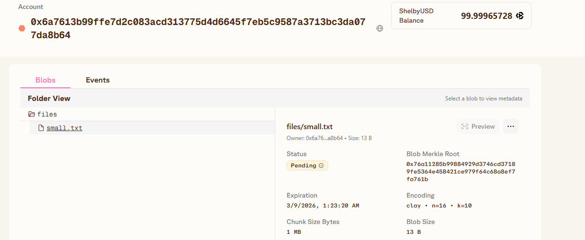

# Shelby Storage Demo

This repository demonstrates how to upload files to **Shelby decentralized storage** using the Shelby CLI.

---

## Overview

Shelby Storage is designed for decentralized data storage in Web3 applications.  
This demo repository shows how developers can upload files using the Shelby CLI.

---

## Project Structure
shelby-storage-demo
│
├── README.md
├── assets/
│ ├── a.txt
│ ├── datacenter.jpg
│ └── test.txt
│
├── docs/
│ └── shelbystorage.png
│
└── scripts/
└── upload.sh

---

## Requirements

Before running this demo, make sure you have:

- Node.js >= 18
- Shelby CLI
- Aptos wallet

---

## Installation

Install Shelby CLI:

```bash
npm install -g @shelby/cli

Check installation:

shelby --version

## Upload Example

Create a sample file:

echo "hello shelby" > test.txt

## Run Upload Script

Make the script executable:

chmod +x scripts/upload.sh

Run the script:

./scripts/upload.sh

## Demo



##Author

GitHub: https://github.com/Yanuarsa14
